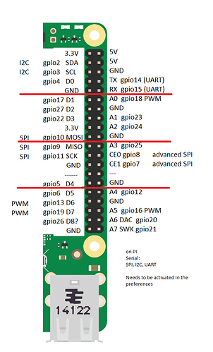
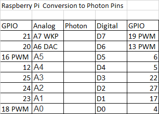

# particle-photon-raspberry-pi-iot
A web based simple interaction between the Particle.io IDE for the Photon or the Raspberry PI 3 for doing IoT 

Working webpage at https://hpssjellis.github.io/particle-photon-raspberry-pi-iot/

Blog about the journey at 

https://community.particle.io/t/raspberry-pi-3-with-touchscreen-and-camera-v2/29378/

Not yet working Feb 25, 2017!

Old but student tested version of this repository at https://github.com/hpssjellis/spark-core-web-page-html-control

For use with the Particle-Photon or the Raspberry Pi using the https://www.particle.io/ IDE

Flash the particle.ino to the Photon or Raspberry Pi and then run the index.html web page.

Enter your access code and ID for your device (note this information is locally stored on your web browser and not sent for cloud storage)

Then test D7 LED for connection.

Then edit the buttons as needed for your device.

Advanced:

Change the web page name to just index.html and upload to https://build.phonegap.com/ to make an Android, Windows or iOS App. (Note: iOS has a yearly fee of $100.00)

An older video of all but the recent stuff is at

https://youtu.be/-CyKv4UC1OA

By @rocksetta

use at you own risk.
